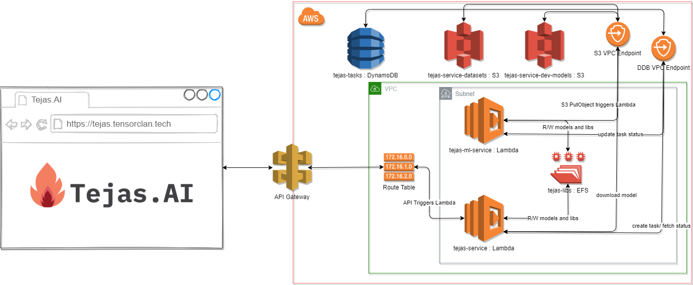

The architecture initially i made was quite complicated, but finally settled on the below,

Here, the EFS, and both the Lambdas are placed inside a Private Subnet in a VPC, which means they cannot access the internet, which was fine by me, for accessing S3 and DynamoDB it was done using VPC Gateway Endpoints.

Here's the flow:

Train Model HTTP Request -> API Gateway -> tejas-service Lambda -> Add Model to S3 -> Add Task to DynamoDB

S3 Event -> tejas-ml-service Lambda -> Save model to EFS -> Update Task Status in DyanamoDB

Train Status HTTP Request -> API Gateway -> tejas-service Lambda -> Return Task Status from DynamoDB

Inference HTTP Request -> API Gateway -> tejas-service Lambda -> Fetch Task's model path from DynamoDB -> Load model and return Inference Result
